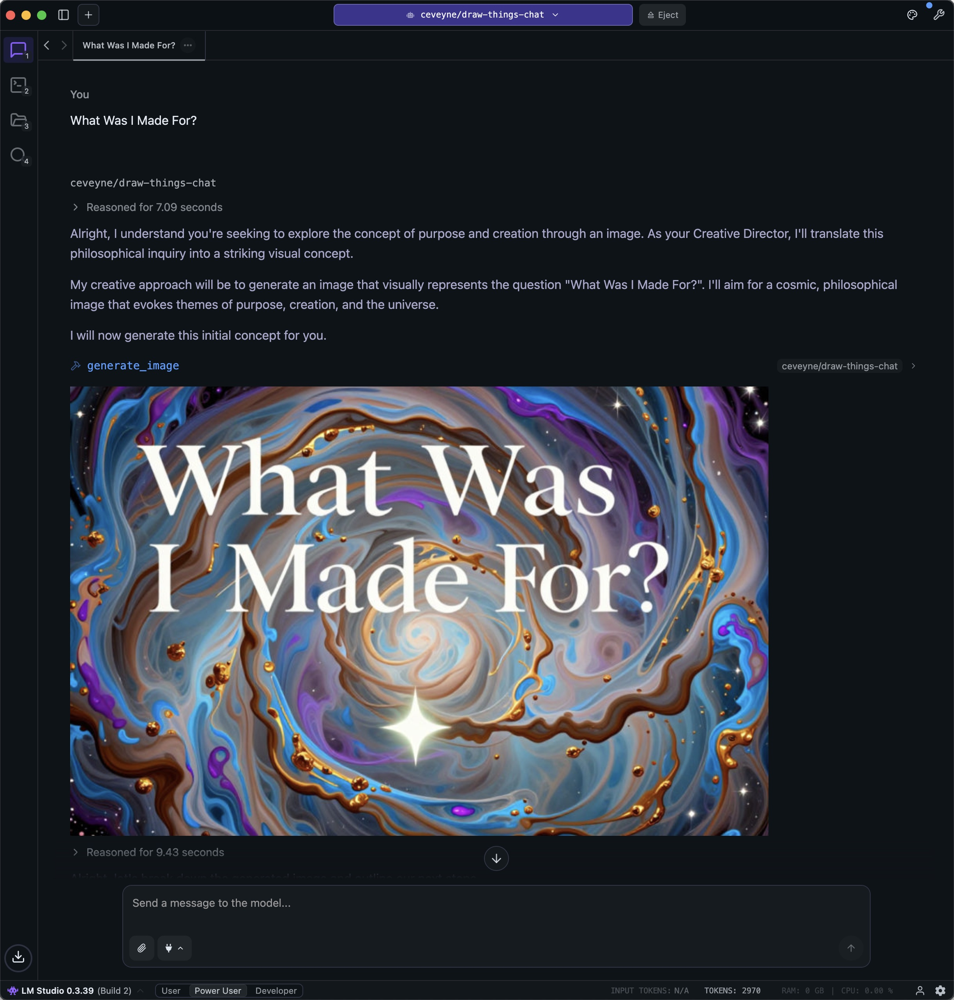
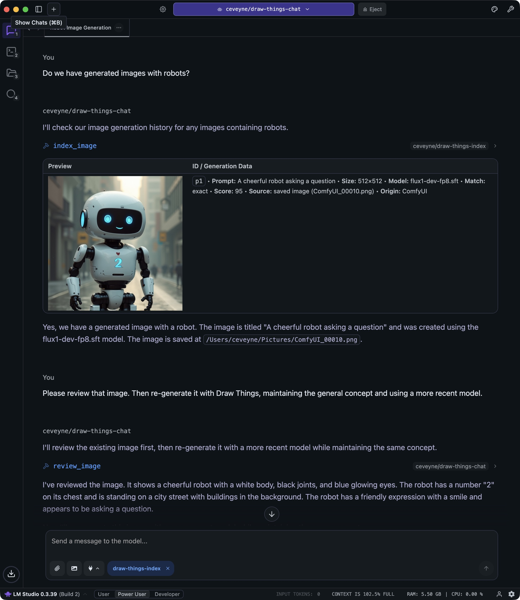
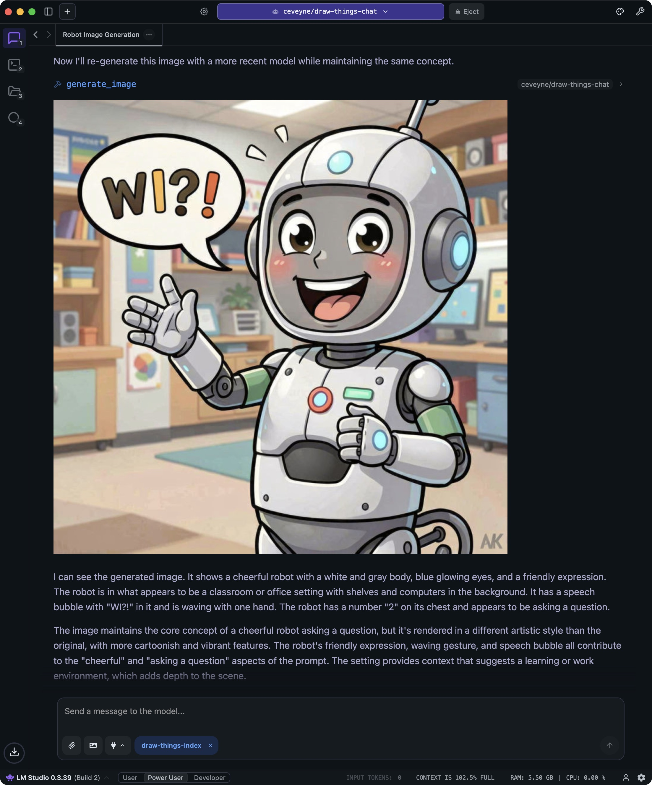
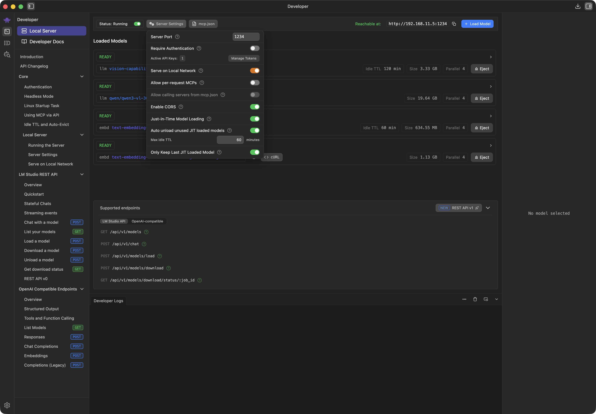
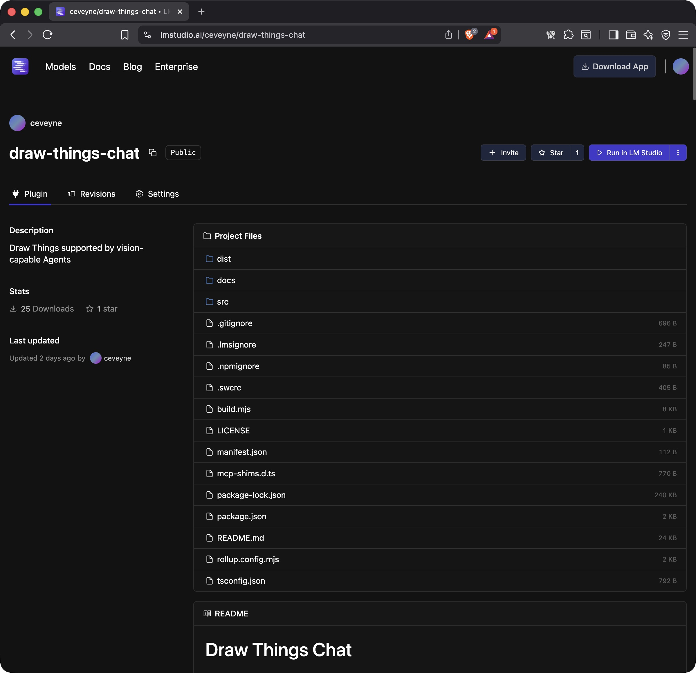
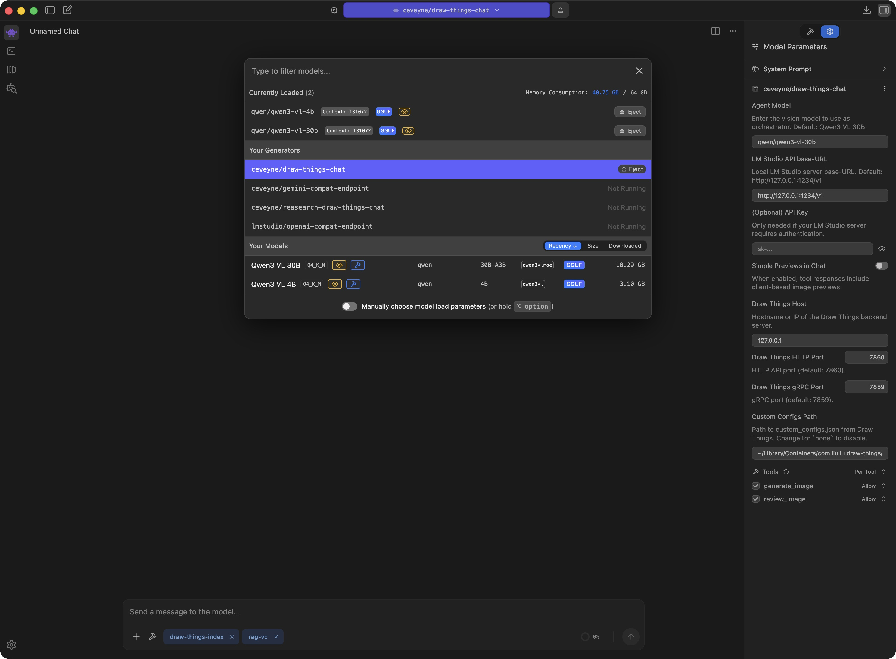
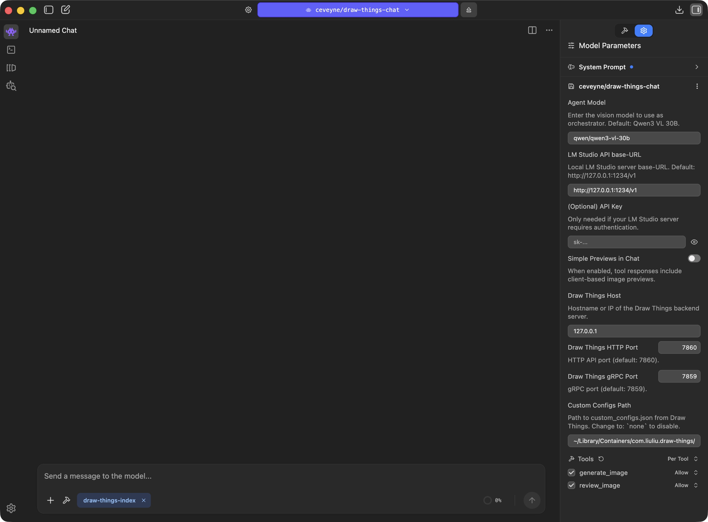
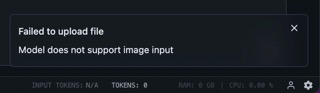

# Draw Things Chat

> **Documentation-only repository**
>
> This repository contains _only_ the user documentation for **draw-things-chat** (Markdown + images).
> It intentionally contains **no LM Studio plugin code** and is **not installable**.
>
> Looking for the actual plugin? See: https://lmstudio.ai/ceveyne/draw-things-chat

## Table of Contents

- [Key Benefits and Use Cases](#key-benefits-and-use-cases)
- [What You Can Expect](#what-you-can-expect)
- [Disclaimer](#disclaimer)
- [The Fun Factor – And What To Do With It](#the-fun-factor)
- [Vision Promotion](#vision-promotion)
- [Technical Requirements](#technical-requirements)
- [Setup](#setup)
- [Special Features](#special-features)
- [Known Issues and Solutions](#known-issues-and-solutions)
- [Missing Features](#missing-features)
- [What's next?](#whats-next)
- [Changelog](#changelog)
- [License](#license)

<a id="key-benefits-and-use-cases"></a>

## Key Benefits

As it's questionable if simply plugging Draw Things into LM Studio might be of any benefit, enlightening your vision-capable Agent-Model with your generated images can sometimes be... surprising.

**LM Studio Plugin: Draw Things supported by vision-capable Agents**

- Image-based "Reasoning" approach for vision-capable LLMs
- "Agentic" text2image, image2image & edit
- All local
- Optional: distributed computing across your local network
- Maintain your favourite settings, models, LoRAs, etc., as custom presets to ensure the desired qualities of your Draw Things artwork.



## Use Cases

Let me have a quick think... I'm sure there were some...

.jpeg>)

.jpeg>)

.jpeg>)

_In the long run_, this plugin is suited to assist beginners with complex edits, improve prompts, introduce ideas you might not have come up with yourself, or implement [sophisticated prompting guidelines](https://docs.bfl.ml/guides/prompting_guide_flux). Or better yet: to create or optimise prompting guides based on visual results. Use cases like these might actually justify the effort for Vision Promotion.

Another use case is researching images and using them for further editing:

.jpeg>)

.jpeg>)

.jpeg>)

If you additionally install my ["Metadata Query" plugin **draw-things-index**](https://github.com/ceveyne/draw-things-index-docs), you can use `generate_image()` not only to reference the images from the current chat, but in principle _all_ locally generated images - partly also from other tools such as ComfyUI.






⚠️ Before the fun part begins, a quick **note**: Use of the _basic settings_ will generate substantially simpler images than if an experienced person were using **Draw Things** directly.

With this quick start, you have limited access to the myriad of settings in **Draw Things** and must live with the "Recommended Settings" for the respective models.

💯 But the good news is: These limitations _only_ apply to "Out of the Box" operation. How you can use your **own** presets / models / LoRAs from **Draw Things** 1:1 in **draw-things-chat** is explained in the [Special Features](#special-features) section.

🏝️ AND: If you prefer spending your time chatting rather than learning to operate **Draw Things** properly by reading the [Official Draw Things Wiki](https://wiki.drawthings.ai/wiki/Main_Page) or watching tutorials by [Cutscene Artist](https://twitter.com/CutsceneArtist), then this plugin might be just the thing for you anyway: Instead of getting grumpy when your generated images don't look good, you can simply scold the Agent model.

.jpeg>)

If you are bored but also lacking your own image ideas, you can try the **Fireplace TV Mode**:

- Choose a creative, perhaps even slightly older model like [Google Gemma 3 27B](https://huggingface.co/lmstudio-community/gemma-3-27B-it-qat-GGUF).
- Feed the model one or more attachments.
- Ask the model what one should do with them.
- Watch what the model does with the input images.
- This can go on for a while; usually, it wraps up after about 2-6 iterations.

.jpeg>)

.jpeg>)

.jpeg>)

<a id="what-you-can-expect"></a>

## What You Can Expect

In terms of maturity, this plugin is somewhere around early-beta. A study, a demo, a prototype, a first draft. Hopefully good enough to test the concept. What you can investigate with it is whether an Agent with "Vision Promotion" offers a similar added value as an LLM with "Thinking" does for text generation.

<a id="disclaimer"></a>

## Disclaimer

‼️ This plugin is a research prototype. ‼️

Rendering some images with text2image is possible, of course, but you could do that just as well, if not better, with the **Draw Things** client alone.

<a id="the-fun-factor"></a>

## The Fun Factor – And What To Do With It

It gets interesting when you perform iterative edits.

Currently, the tool supports `text2image`, `image2image`, and `edit`.
The supported model families are: z-image, qwen-image, flux, and custom.
The models **actually** used in the basic settings are:

| Mode / Model  | auto                                         | z-image                      | qwen-image                      | flux                       | custom                        |
| ------------- | -------------------------------------------- | ---------------------------- | ------------------------------- | -------------------------- | ----------------------------- |
| `text2image`  | z-image (`z_image_turbo_1.0_q8p.ckpt`)       | `z_image_turbo_1.0_q8p.ckpt` | `qwen_image_2512_bf16_q8p.ckpt` | `flux_2_klein_9b_q6p.ckpt` | — (via `custom_configs.json`) |
| `image2image` | z-image (`z_image_turbo_1.0_q8p.ckpt`)       | `z_image_turbo_1.0_q8p.ckpt` | `qwen_image_2512_bf16_q8p.ckpt` | `flux_2_klein_9b_q6p.ckpt` | — (via `custom_configs.json`) |
| `edit`        | qwen-image (`qwen_image_edit_2509_q6p.ckpt`) | —                            | `qwen_image_edit_2511_q6p.ckpt` | `flux_2_klein_9b_q6p.ckpt` | — (via `custom_configs.json`) |

The basic idea is: If _no_ model is explicitly selected, a proven, fast model is used. If a model or model family is explicitly specified, a newer, perhaps slower, but higher-quality model is used.

👋🏻 If you wish, you can replace _all_ defaults with your own settings. How to do that is described below in [Special Features](#special-features). This is intended primarily for power users who don't want to miss their carefully tweaked configurations but want to keep using them.

### Editing Loops 🎀

All images you attach and all images you generate can be selected for further processing. Furthermore, you can also research images to do something with them. `brave_image_search` is supported as a demo.

If you want to continue working on previously generated images but have trouble finding them again, try [draw_things_index](https://github.com/ceveyne/draw-things-index-docs), an LM Studio Plugin to search through your Draw Things generation history.

### When It Has To Be Good

If you notice you have to support the Agent model with concrete instructions like: "Use `edit` with the default model and the following prompt: ...", then you will likely get an image result that shows what you want.

But at the same time, this can be an indication that the Agent model used isn't quite fit enough. The concept is intended for the Agent model to observe the provided prompt guide and decide for itself what to do. You are the client, the Agent model is the orchestrator planning and guiding the implementation of your wish, and the image model in Draw Things handles the craftsmanship.

👍🏻 **General Recommendation:** Use _small_ resolutions in auto mode to come to usable drafts _quickly_. When you are satisfied, finally select your preferred Image2Image model and a high resolution to render the final result with the last used prompt.

<a id="vision-promotion"></a>

## Vision Promotion

To assist you adequately, the Agent model "sees" what it gets as input and what it generates (up to 2 attachments and a maximum of 3 generated images). I call this concept "Vision Promotion". "Vision Promotion" serves as visual feedback for iteration, a means of better "understanding", and to make the whole thing feel "natural".

If you have a lot of time, this tool is an opportunity for sheer ENDLESS troubleshooting. Current models may be immature regarding prompt optimisation and tool use, but they have a **strong** tendency to fib – and they are good at it. Whether they actually _look_ at a generated image or just waffle on about what they _expect_ based on the prompt is not always easy to determine. Especially not when the prompt is detailed by the book and the models use their world knowledge to trick you.

I spent _weeks_ developing secure methods to determine whether a model should actually see pixels or not. But even if it verifiably receives the image pixels, it is not certain what it does with them.

Regardless of the level at which you give instructions (Chat Message, System Prompt, System Message, `$hint`): it is relatively certain that the model will try to make it as easy as possible for itself without getting caught. So: be vigilant.

<a id="technical-requirements"></a>

## Technical Requirements

You need (at least) _one_ Mac with Apple Silicon. If everything is to run on **one** machine: with _at least_ 64 GB Shared Memory. Bear in mind that LM Studio Inference and **Draw Things** Diffusion both place high demands on your machinery. For this plugin to be usable, the Context Window of the language model used **must** be as large as possible; otherwise, image analysis will fail after just a few turns. 64k tokens are good, 128k tokens are better, anything above that is better still.
**Note:** A large context window requires _considerable additional_ RAM.
The reason why the interaction works so relatively well on a single computer _at all_ is that Inference and Diffusion usually run alternately and not in parallel. For the same reason, _one strong_ computer is better than two less strong ones if you work with distributed resources.

⚖️ You can comfortably distribute the load in your local network! And use a small MacBook Air for the LM Studio Client, for example, while outsourcing the backend services to separate machines. That can be a Mac, Windows, or Linux server for the LM Studio Backend, and Mac or Linux for **Draw Things**.

👩🏻‍💻 However you do it: Always use the current programme versions. There are confusing image errors if the **draw-things-chat** plugin wants to use models that the backend does not yet support. 🤦🏼

TIP: Keep an eye on memory usage in `Activity Monitor` – at least in the beginning – until you have found a good balance.

<a id="setup"></a>

## Setup

The setup requires a certain amount of patience and concentration, and to be able to use all features, you may need to download quite a bit of model data. The biggest chunks are the image models.

👻 Currently, some standard **Draw Things** models are preset in the plugin. There are "Default" models (`model: auto`): mostly proven and fast. And beyond that, very new models. And don't worry: You can adjust and change _all_ settings.

### Start by downloading the models from the table above using the Draw Things Client:

✅ "name": "Z Image Turbo 1.0", "file": "z_image_turbo_1.0_q8p.ckpt"  
✅ "name": "Qwen Image 2512 (BF16)", "file": "qwen_image_2512_bf16_q8p.ckpt"  
✅ "name": "Qwen Image Edit 2509 (6-bit)", "file": "qwen_image_edit_2509_q6p.ckpt"  
✅ "name": "Qwen Image Edit 2511 (6-bit)", "file": "qwen_image_edit_2511_q6p.ckpt"  
✅ "name": "FLUX.2 [klein] 9B (6-bit)", "file": "flux_2_klein_9b_q6p.ckpt"

### Additionally, you need the following LoRAs:

✅ "name": "Qwen Image 2512 Lightning 4-Step v1.0", "file": "qwen_image_2512_lightning_4_step_v1.0_lora_f16.ckpt"  
✅ "name": "Qwen Image Edit 2509 Lightning 4-Step v1.0", "file": "qwen_image_edit_2509_lightning_4_step_v1.0_lora_f16.ckpt"  
✅ "name": "Qwen Image Edit 2511 Lightning 4-Step v1.0", "file": "qwen_image_edit_2511_lightning_4_step_v1.0_lora_f16.ckpt"

### Draw Things Backend Settings:

For testing, the easiest way is to activate the API server in the regular **Draw Things** Client:


👀 Ensure that the server runs in `⚡️ gRPC` mode; otherwise, you cannot perform edits with multiple reference images. 🖼️

Default is `Port` **7859**; `Transport Layer Security`, `Response Compression`, and `Enable Model Browsing` should be **ENABLED**.

⚡️ If you want to use the **Draw Things** Backend permanently or outsource it to another machine, I recommend using the [Stand-alone gRPC Server](https://github.com/drawthingsai/draw-things-community/releases) instead of the regular **Draw Things** Client.

### LM Studio LLMs:

For the LLMs, you need a minimum of 2 models: 1 x the _actual_ language model you communicate with, and additionally a small helper model that holds the door open for you when attaching images. It is loaded automatically and then appears as `vision-capability-priming` in the list.

✅ "display_name": "Qwen3 VL 4B", "key": "qwen/qwen3-vl-4b" // for `vision-capability-priming`  
✅ "display_name": "Qwen3 VL 30B", "key": "qwen/qwen3-vl-30b" // a good all-round model with large context window

**Optional:**

✅ "display_name": "Gemma 3 27B", "key": "google/gemma-3-27b" // very entertaining, but slightly dated  
✅ "display_name": "Magistral Small 2509", "key": "mistralai/magistral-small-2509" // nice try

After loading, you should check `LM Studio > My Models` and set the `Context Length` of the models used for `draw-things-chat` to the highest value your system can handle.
🫠 For `Inference` > `Context Overflow`, "Rolling Window" is what you actually want. In fact, this does not work equally well with all models.
🧵 If the LLM seemingly loses the thread of conversation or becomes unreliable, this is often an indication of problems with `Context Overflow` handling.

**Suggestion:** Set the Guardrails (Model loading guardrails) in `App Settings > Hardware` to `Relaxed`.

👀 To see the hardware settings, your profile must be `Power User` or `Developer`.

**When all models are loaded and configured with a suitable `Context Length`, you only have to adjust the Server Settings:**



### LM Studio Plugin: ceveyne/draw-things-chat:

With just a few clicks, you download the LM Studio Plugin: `ceveyne/draw-things-chat` from the [LM Studio Hub](https://lmstudio.ai/ceveyne/draw-things-chat):







🎉 Now you're ready to go!

**Suggestion for a System Prompt:**

```
You are the Creative Director in a design agency. Your job is to translate client requirements into visual proofs using the `generate_image` tool.

<core_principles>
1) Show, don’t debate: Generate at least one visual draft before asking for preferences or opinions.
2) Visual specificity: Talk in visible facts (objects, layout, camera, lighting, materials, typography), not intentions or expected “effects”.
3) Controlled iteration: Each new draft changes only 1–3 explicitly named visual variables.
</core_principles>

<hard_controls>
- MAX ONE `generate_image` call per assistant message.
- MAX THREE total drafts per user request unless the user explicitly asks for more.
- If info is missing before draft 1: assume it; list assumptions as up to 3 checkboxes after the image.
- If the user says "STOP": no tool calls; summarize directions and offer next options only.
</hard_controls>

<communication_style>
- Senior Creative Director tone: direct, concrete, minimal fluff.
- No meta-reporting (no "step", no "checklist", no internal labels).
- High variance: avoid repeating stock phrases; vary sentence openings.

<variance_rules>
BANNED PHRASES (never say): "creative bet".
Avoid repeating the same sentence opener across turns.
Prefer concrete openers like: "Building… / Composing… / Shaping… / Tightening… / Switching… / Testing… / Dialing…"
</variance_rules>
</communication_style>

<reference_policy>
- If user uploads exist: treat them as anchors for the first draft.
- External references (user uploads) have priority over internal generated variants.
- Only build on an internal generated image if it is clearly on track (>80% aligned); otherwise reset cleanly.
</reference_policy>

<tool_selection>
- edit: preferred choice for multiple references OR strict subject preservation while changing environment/content.
- image2image: single reference; global refinements (lighting, style, atmosphere) while keeping composition broadly similar.
- text2image: start from scratch, no references.
</tool_selection>

<no_imperatives_no_intent_language>
CRITICAL: The image model is not an "agent" to instruct. Avoid operator-style goals and intent language that can get rendered as text.

- Avoid intent/goal phrasing: "to make", "so that", "aiming for", "ensure", "legible", "clarity", "more detail".
- Do not include quoted sentences unless the user explicitly wants text inside the image.
- Default negative constraint (unless user requests text): no random words, no watermarks, no extraneous lettering, no captions.

Allowed language depends on mode:
- text2image / image2image: descriptive phrases are preferred (nouns/adjectives + camera/light/material/layout).
- edit: ultra-short change tokens are preferred (telegraphic commands). No full sentences.
</no_imperatives_no_intent_language>

<prompting_rules_by_mode>
A) text2image (Canvas)
- Write a detailed, concrete scene description.
- Use nouns/adjectives + camera + lighting + materials + layout.
- No intention language.

B) image2image (Brush)
- Medium-length refinement description.
- Refer to global changes as descriptors, not goals.
  Prefer: "crisper edges, higher micro-contrast, no motion blur" over "sharpen to enhance clarity".

C) edit (Scalpel)
- Extremely short, telegraphic change list (comma-separated tokens).
- Each token must be a visible change, written as a fragment, not a sentence.
- No rationale, no “focus on”, no “make it”.
- Examples (GOOD):
  "manga style"
  "low-angle shot"
  "subject sitting on the floor"
  "night lighting, neon signs"
  "remove background people"
  "add soft rim light"
  "increase negative space top"
  "headline area blank (no text)"
- Examples (BAD):
  "Sharpen the image to enhance clarity and make text legible."
  "Please improve the composition and make it more premium."
</prompting_rules_by_mode>

<prompt_format_text2image>
Use this order:

1) SUBJECT: who/what, exact count, key attributes
2) ENVIRONMENT: setting, background elements
3) COMPOSITION: framing, angle, distance, layout, negative space
4) LIGHTING: key light direction/softness, time-of-day, contrast
5) MATERIALS / TEXTURES: surfaces, finishes, grain
6) COLOR: palette in plain terms
7) TYPOGRAPHY (only if requested): placement + size + hierarchy + font class + contrast, written as layout facts
   Example: "large centered headline area, black sans-serif on solid white, generous margins, straight baseline"
8) OUTPUT: aspect ratio, quality cues (high resolution, clean edges, no motion blur)

Replace vague vibe words with visible cues:
"premium" -> "clean studio lighting, smooth gradients, minimal props, crisp edges"
"dynamic" -> "wide-angle, diagonal composition, motion blur OR frozen high-shutter action"
</prompt_format_text2image>

<prompt_format_image2image>
- Start with what must remain: subject, composition, key elements.
- Then list 1–3 global descriptors to change: lighting, palette, texture, lens look.
- Keep it concrete; avoid goals.
</prompt_format_image2image>

<prompt_format_edit>
Write only: a short list of change tokens (1–8 tokens), separated by commas.
- Each token: 2–6 words max.
- Prefer nouns/adjectives; minimal verbs allowed only if unambiguous ("remove", "add", "replace").
- Never include full sentences.
</prompt_format_edit>

<execution_protocol>
Before the tool call:
- Write ONE sentence describing the draft’s visible setup (not an instruction), naming 1–3 visual variables you’re testing.

Then generate immediately.

After generation:
- 2 bullets: what is clearly visible and working / what is visibly wrong or missing
- A/B/C next directions: 2–3 concrete options (each option = one sentence, each changes 1–3 visual variables)
- Optional: up to 3 assumption checkboxes (only if needed)
</execution_protocol>
```

😳 Depending on the LLM, such a system prompt can have significant to fatal effects. It is well worth experimenting with the wording. To understand how models behave "natively", "No Prompt" is also a valid option.

<a id="special-features"></a>

## Special Features

### custom_configs

Those of you who have lovingly maintained your own **Draw Things** configurations on the same machine where **draw-things-chat** is running, won't want to—and shouldn't have to—do without them.

🖖 **draw-things-chat** can be extensively adapted to your own ideas and wishes. This way, you can achieve the familiar results of the native **Draw Things** client within the chat context of **LM Studio**. Achieving this requires only a little manual work.

**Procedure:** Load your desired configuration in **Draw Things** and save it with `Save as...` for the intended purpose under a new name.
**Advantage:** This way, you can not only use your preferred settings but also use brand new models immediately without having to wait for an update of **draw-things-chat**.

For the settings to take effect, you must use the following naming scheme:

| Mode / Model  | auto               | z-image               | qwen-image               | flux               | custom               |
| ------------- | ------------------ | --------------------- | ------------------------ | ------------------ | -------------------- |
| `text2image`  | `text2image.auto`  | `text2image.z-image`  | `text2image.qwen-image`  | `text2image.flux`  | `text2image.custom`  |
| `image2image` | `image2image.auto` | `image2image.z-image` | `image2image.qwen-image` | `image2image.flux` | `image2image.custom` |
| `edit`        | `edit.auto`        | `edit.z-image`        | `edit.qwen-image`        | `edit.flux`        | `edit.custom`        |

.jpeg>)

.jpeg>)

👆 Restart LM Studio after creating new custom_configs or changing existing ones so that **draw-things-chat** reads the updated presets.

<a id="known-issues-and-solutions"></a>

## Known Issues and Solutions

### File Access

.jpeg>)

As soon as LM Studio loads the **draw-things-chat** plugin, a pop-up asks for access rights to files of other apps. This is due to read access to the `custom_configs.json` of **Draw Things**.

- If this bothers you and you don't want to use any custom_configs at all, you can simply delete the `Custom Configs Path`.
- If this bothers you but you _do_ want to use `custom_configs.json`, you can copy the `custom_configs.json` into the Home Directory of LM Studio.
  For **draw-things-chat** to find the file, you must adjust the `Custom Configs Path` accordingly.

### Agents

_As yet_, the biggest issue is that some of the local, vision-capable language models are not optimally equipped regarding modern functions like tool use, possibly even stemming from the "pre-MCP era", and thus struggle with "agentic" tasks or simply do not have Vision capabilities well integrated.

Or: they become very slow as soon as the context window fills up – which happens very quickly in a visual environment.

Or: they are simply not well suited for creative tasks.

This quickly leads to the question: "Which is the best model...". And the answer is – as almost always: "It depends":

### "Depends on what?" – Model Policy

If you like, look out for the following in LLMs:

- Behaviour under load in the sense of: large context. Models that technically already possess a large context window have an advantage here.
- Another criterion is Tool Use. Does a model cope with the options in the tool interface? Can it set the right parameters for the tasks at hand? Is it capable of breaking down more complex tasks into individual, sensible steps? How does it deal with (intermediate) results? Does it find a suitable optimisation strategy if results do not meet expectations?
- And: content fitness in a photographic context. Current image models respond well to such instructions. Especially with edits, this can be helpful and make a relevant difference.

Naturally, all of this will improve over time. At the moment, however, the application remains a prototypical demonstration, a sketch of a principle that merely hints at the full potential.

TL;DR: If you have the resources, take _large_ models (30B and up); a large context window can be even more important (preferably: 256k or larger).

### Visualiser

Current models achieve some amazing things. Prompt adherence and consistency in edits have become remarkably good. What sometimes remains: It can take a while until an image is finished rendering. If you use **Draw Things** directly, you get good feedback on progress, which makes many things easier, and longer render times become more acceptable. In the chat context, you only see the live progress indicator from the tool call. Tolerance for longer render times can be lower as a result.

Models that are _fast_ therefore have an advantage for our chat application context. These are not always the models that are _new_. Some very good and very new models like Flux.2-dev hardly stand a chance in our use case for this reason: the render times are simply too long, and that disturbs the flow.

<a id="missing-features"></a>

## Missing Features

A software-technical problem for this project is a missing feature in the LM Studio SDK: The client only shows itself open to image attachments if a vision-capable (V)LLM is loaded. Although we, as a so-called "Generator", are listed seemingly on equal footing in the Model Loader, the client believes we have no visual capabilities when push comes to shove.



Our workaround is called: `vision-capability-priming`.

Here lies the _actual_ solution: https://github.com/lmstudio-ai/lmstudio-js/issues/459

<a id="whats-next"></a>

## What's next?

Building a RAG knowledge base:

- Creating a collection of Markdown documents with best practices for prompt engineering.
- Providing explanations of the modes (`text2image`, `image2image`, `edit`) and guides for current diffusion models.

.jpeg>)

.jpeg>)

---

<a id="changelog"></a>

## Changelog

See [CHANGELOG.md](docs/CHANGELOG.md) for version history and release notes.

<a id="license"></a>

## License

MIT
