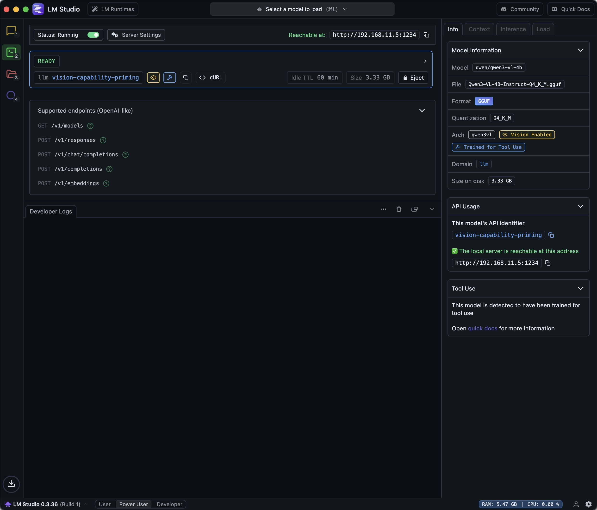
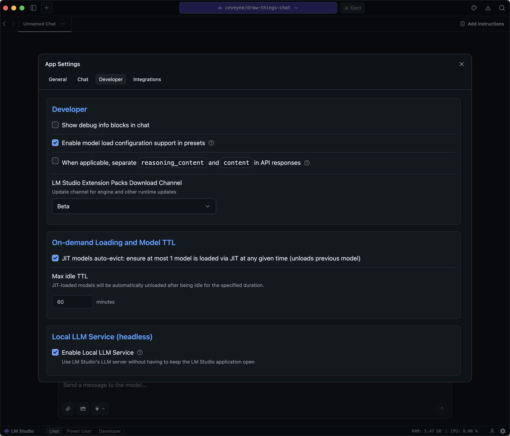
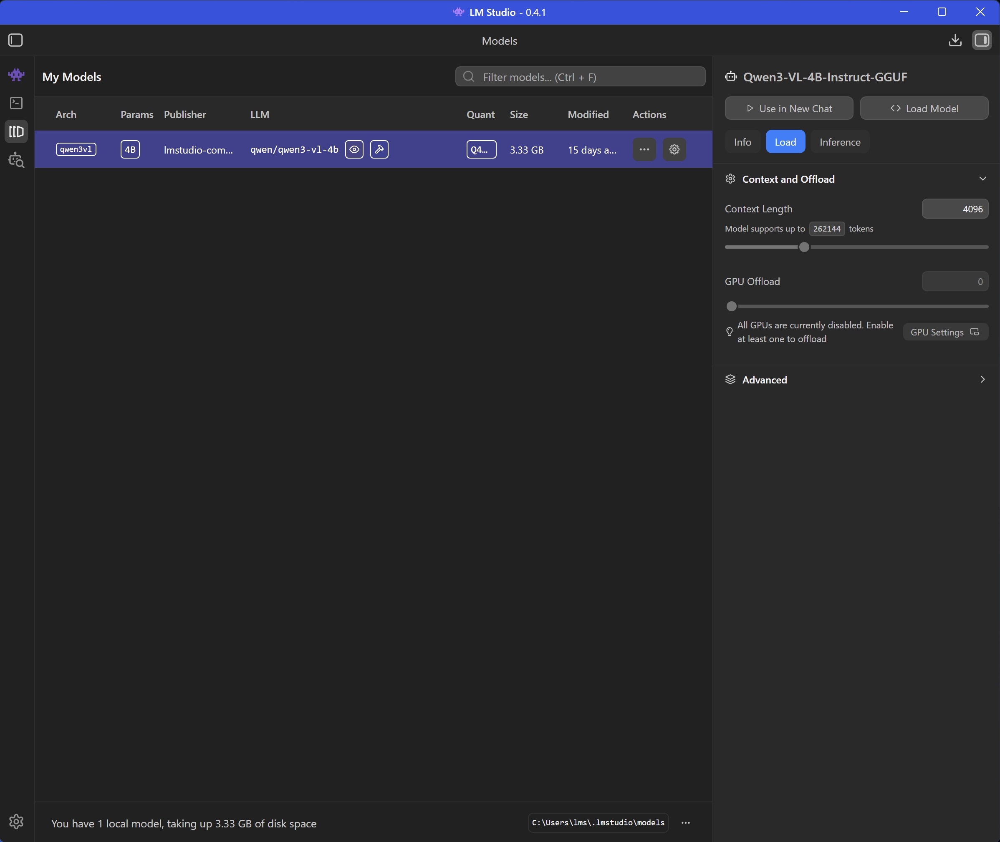

# Draw Things Chat

> **Documentation-only repository**
>
> This repository contains _only_ the user documentation for **draw-things-chat** (Markdown + images).
> It intentionally contains **no LM Studio plugin code** and is **not installable**.
>
> Looking for the actual plugin? See: https://lmstudio.ai/ceveyne/draw-things-chat

## Table of Contents

- [Key Benefits](#key-benefits-and-use-cases)
- [Setup](#setup)
  - [Draw Things user on Mac](#setup-mac-draw-things)
  - [LM Studio user on Windows or Linux – MCP-based image generation](#setup-windows-linux-mcp)
  - [LM Studio user on Linux – Draw Things backend image generation](#setup-linux-draw-things)
- [Invoke formerly generated images: Metadata Query plugin draw-things-index](#setup-draw-things-index)
- [More detailed user docs](#detailed-user-docs)
- [Changelog](#changelog)
- [License](#license)

## Key Benefits

As it's questionable if simply plugging Draw Things into LM Studio might be of any benefit, enlightening your vision-capable Agent-Model with your generated images can sometimes be... surprising.

**LM Studio Plugin: Draw Things supported by vision-capable Agents**

- Image-based "Reasoning" approach for vision-capable LLMs
- "Agentic" workflows for text2image, image2image & edit
- Re-use of any previously generates content (requires ["Metadata Query" plugin **draw-things-index**](https://github.com/ceveyne/draw-things-index-docs))
- All local
- Optional: distributed computing across your local network
- Maintain your favourite settings, models, LoRAs, etc., as custom presets to ensure the desired qualities of your Draw Things artwork.

## Setup

### Draw Things user on Mac

1. Prepare for `text2image`, `image2image` and `edit` modes by simply providing your favourite **Draw-Things**-settings for use with **draw-things-chat**:

- **Draw-Things** > Basic Settings > Load your preferences > Save as... `text2image.auto`, `image2image.auto`, `edit.auto`

.jpeg>)

.jpeg>)

- ⚠️ Note: These settings are stored to `<Your_configured_Model-Folder>/custom_configs.json`. It might be a good idea to keep this file in sync with the one located inside your Default-Model-Folder (`~/Library/Containers/com.liuliu.draw-things/Data/Documents/Models/custom_configs.json`)

2. Setup **Draw Things** gRPC server:

- **Draw-Things** > Advanced Settings: `API Server: enable`, `⚡️ gRPC  Port: 7859`, `Transport Layer Security: enable`, `Response Compression: enable`, `Enable Model Browsing: enable`

3. Prepare your **LM Studio Client** for the `vision-capability-primer`:

- Download the required helper-model `qwen/qwen3-vl-4b` to your **local** computer

4. Prepare your **LM Studio Server**:

- Download your preferred vision-capable agent-model (default: `qwen/qwen3-vl-30b`) to your **server** computer
- Set appropriate context length for your vision-capable agent-model
- Enable your **LM Studio Server**

5. Install the **draw-things-chat** plugin:

- https://lmstudio.ai/ceveyne/draw-things-chat

- Activate the **draw-things-chat** plugin with the model-loader

- Adjust the **draw-things-chat** plugin-settings to your local machine and network

### LM Studio user on Windows or Linux - MCP-based image generation

1. Prepare your **LM Studio Client** for the `vision-capability-primer`:

- Download the required helper-model `qwen/qwen3-vl-4b` to your **local** computer
- ⚠️ Note: This model is not intended to be used for inference. Hence it doesn't need any GPU support.

2. Prepare your **LM Studio Server**:

- Download your preferred vision-capable agent-model (default: `qwen/qwen3-vl-30b`) to your **server** computer
- Set appropriate context length for your vision-capable agent-model
- Enable your **LM Studio Server**

3. Install the **draw-things-chat** plugin:

- https://lmstudio.ai/ceveyne/draw-things-chat

- Activate the **draw-things-chat** plugin by choosing it from the model-loader

.jpeg>)

- Adjust the **draw-things-chat** plugin-settings to your local machine and network: Disable the built-in tool 'generate_image()' to use any MCP-tool for image-generation that delivers base64 as tool-result.

.jpeg>)

### LM Studio user on Linux - Draw-Things-backend image generation

1. Follow the instructions here to setup the [**Draw Things** gRPC Server](https://github.com/drawthingsai/draw-things-community/releases)

- For model-management and custom_configs it's easiest to use the Draw Things Client on macOS.

2. Prepare for `text2image`, `image2image` and `edit` modes by simply providing your favourite **Draw-Things**-settings for use with **draw-things-chat**:

- **Draw-Things** > Basic Settings > Load your preferences > Save as... `text2image.auto`, `image2image.auto`, `edit.auto`

.jpeg>)

.jpeg>)

- ⚠️ Note: These settings are stored to `<Your_gRPC-configured_Model-Folder>/custom_configs.json`. It might be a good idea to keep this file in sync with the one located inside your Default-Model-Folder (`~/Library/Containers/com.liuliu.draw-things/Data/Documents/Models/custom_configs.json`)

3. Prepare your **LM Studio Client** for the `vision-capability-primer`:

- Download the required helper-model `qwen/qwen3-vl-4b` to your **local** computer

4. Prepare your **LM Studio Server**:

- Download your preferred vision-capable agent-model (default: `qwen/qwen3-vl-30b`) to your **server** computer
- Set appropriate context length for your vision-capable agent-model
- Enable your **LM Studio Server**

5. Install the **draw-things-chat** plugin:

- https://lmstudio.ai/ceveyne/draw-things-chat

- Activate the **draw-things-chat** plugin with the model-loader

- Adjust the **draw-things-chat** plugin-settings to your local machine and network

### Invoke formerly generated images: Metadata Query plugin draw-things-index

See the [draw-things-index documentation](https://github.com/ceveyne/draw-things-index-docs) for setup instructions.

## Workflow example (Draw Things backend)

.jpeg>)

.jpeg>)

.jpeg>)

## Usecase example (ComfyUI backend)

---

## More detailed user docs

See [USER_GUIDE.md](docs/USER_GUIDE.md) for in-depth documentation, use cases, technical requirements, known issues, and more.

## Changelog

See [CHANGELOG.md](docs/CHANGELOG.md) for version history and release notes.

## License

MIT
